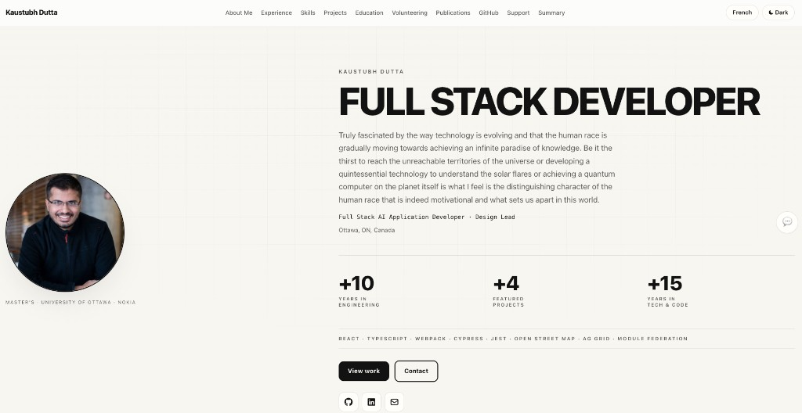
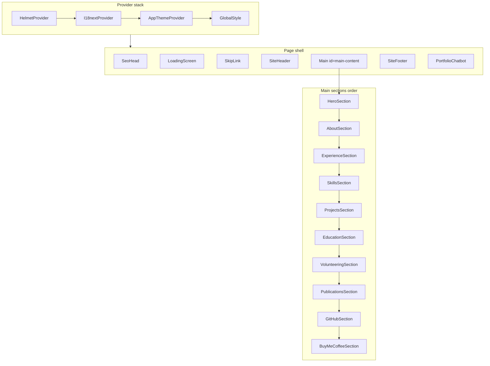
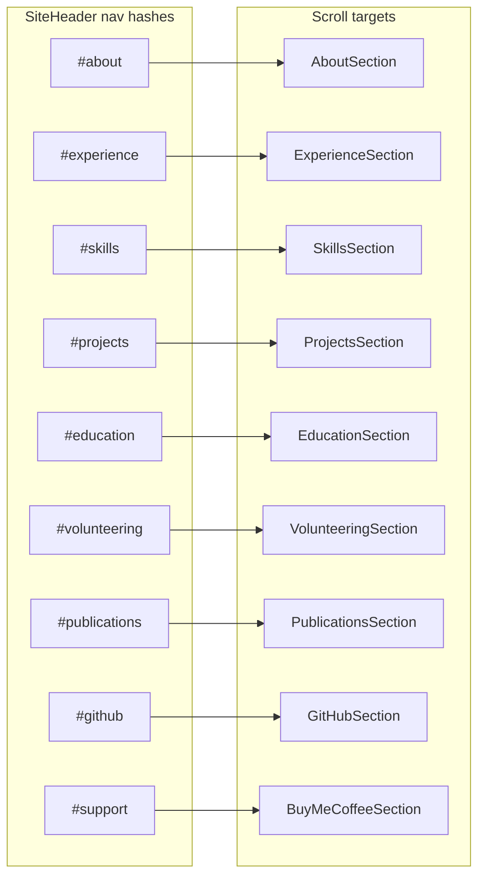
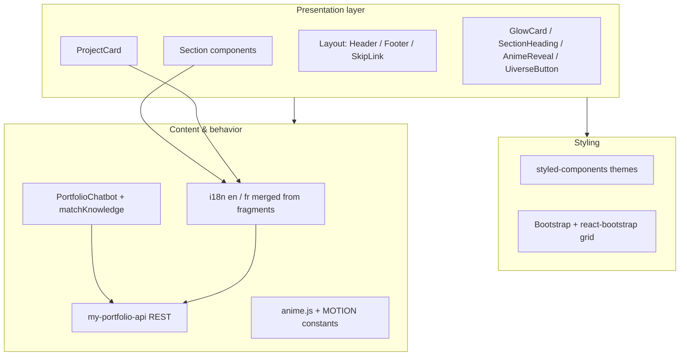
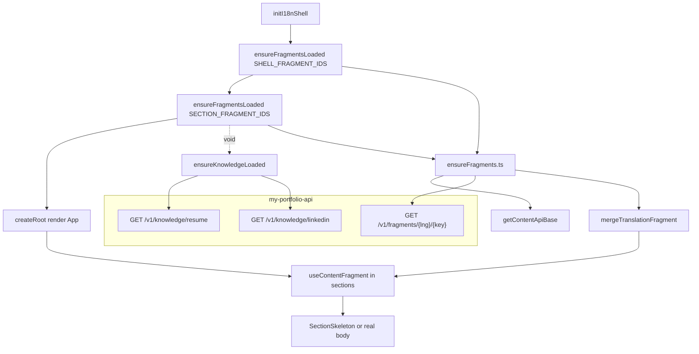
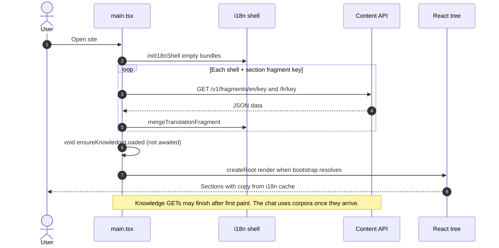

# my-portfolio

Repository for **Kaustubh Dutta**’s portfolio site: projects, experience, publications, résumé links, and bilingual (English / French) content.

<h2 align="center">
  Portfolio Website 
  <a href="https://kaustubhdutta.com/" target="_blank">Kaustubh Dutta</a>
</h2>

  

 

<h3 align="center">
    🔹
    <a href="https://github.com/kdutta25/my-portfolio/issues">Report Bug</a> &nbsp; &nbsp;
    🔹
    <a href="https://github.com/kdutta25/my-portfolio/issues">Request Feature</a>
</h3>

---

## Tech stack

- **Runtime:** React 18, TypeScript, **Vite 5**
- **Styling:** styled-components 6, Bootstrap 5 + react-bootstrap (layout grid / utilities)
- **Motion:** anime.js (entrance animation, micro-interactions)
- **i18n:** i18next + react-i18next — copy is merged at runtime from **my-portfolio-api** fragment endpoints (`GET /v1/fragments/{lng}/{key}`), bootstrapped before the first paint (see **Content API and environment** below). Configure the API origin with **`VITE_CONTENT_API_BASE_URL`** (or legacy **`VITE_SITE_CONTENT_URL`**).
- **SEO:** react-helmet-async (`SeoHead`)
- **Extras:** react-icons, react-github-calendar, floating **Portfolio** chat panel with lightweight FAQ matching (`src/chat/matchKnowledge.ts` + résumé / LinkedIn text from the content API)

---

## Application views (single-page sections)

The UI is one **long-scroll landing page** (`src/App.tsx`). There is no client-side router; **“views”** are scroll targets (`id` anchors) wired from the sticky header and the chatbot.

| Anchor | Section component | Role |
|--------|-------------------|------|
| `#top` | `HeroSection` | Above-the-fold identity: photo, headline, tagline, primary CTAs (scroll / external links). |
| `#about` | `AboutSection` | Bio / positioning narrative (`aria-labelledby="about-heading"`). |
| `#experience` | `ExperienceSection` | Timeline-style work history (`ExperienceGrouped` + locale-driven copy). |
| `#skills` | `SkillsSection` | **Professional skillset** grid (languages, frameworks, tools including image-based entries). Nested **Models & assistants** region lists AI tooling cards (Composer, GPT Codex, Claude Opus) with artwork under `public/images/ai-models/`. |
| `#projects` | `ProjectsSection` | Featured projects as **`ProjectCard`** tiles (see below). |
| `#education` | `EducationSection` | Degrees and institutions. |
| `#volunteering` | `VolunteeringSection` | Volunteer roles. |
| `#publications` | `PublicationsSection` | Papers / publications list. |
| `#github` | `GitHubSection` | Contribution calendar (`react-github-calendar`) and GitHub presence. |
| `#support` | `BuyMeCoffeeSection` | Support / “Buy Me a Coffee” call-to-action. |

**Global chrome (not section anchors):**

- **`SiteHeader`** — Sticky nav; in-page hash links + theme / language toggles; **README** opens this repo on GitHub and **résumé** opens the PDF — both in a new tab, like external docs.
- **`SiteFooter`** — Attribution, copyright, social links, “Built with React, TypeScript and Vite”.
- **`SkipLink`** — Skip to `#main-content`.
- **`LoadingScreen`** — Full-screen loader until ready (skipped in test env via `isTestEnv()`).
- **`PortfolioChatbot`** — Fixed panel: section chips, regex/heuristic replies, optional scroll-to-hash; resume corpus matching for FAQ-style answers.

### Project cards (`ProjectCard`)

Project copy and metadata come from **`projects.items`** in the English and French locale objects served by the content API (`ProjectItem` in `src/types/content.ts`).

| Feature | Details |
|---------|---------|
| **Cover image** | Optional **`coverImage`** path under `public/` (16×10 header). Placeholder SVGs live in **`public/images/projects/`** — e.g. `hyperledger-blockchain.svg`, `ct-reconstruction.svg`, `wireless-spybot.svg`, `dawn-dusk-lamp.svg`. If omitted, the card uses a hue-based gradient. |
| **Links** | Optional **`linkLabel` / `url`** and **`secondaryLinkLabel` / `secondaryUrl`** (PDF, PPTX, etc.). Hrefs are built with **`resolvePublicAsset`** so deployments respect Vite **`BASE_URL`**. |
| **Hyperledger** | Literature review PDF (`Kaustubh-Dutta-Literature-Review.pdf`), blockchain presentation PPTX (`Kaustubh-Dutta-Hyperledger-Blockchain-Presentation.pptx`), and the Hyperledger cover SVG — served as static files from **`public/`**. |

Other shared assets include **`public/Kaustubh-Dutta-Resume.pdf`** (header résumé link), skill/company logos, and **`public/images/ai-models/`** artwork for the skills section. Locale JSON and résumé / LinkedIn corpora for the assistant live in **my-portfolio-api** (`data/`), not in this repository.

---

## UI architecture

- **Composition root:** `App` wraps **HelmetProvider** → **I18nextProvider** → **AppThemeProvider** → `GlobalStyle` + page shell.
- **Theme:** `AppThemeProvider` toggles **light/dark** `AppTheme` tokens (`src/theme/theme.ts`) — colors, typography stacks (`Syne` / `DM Sans` / `JetBrains Mono`), radii, shadows — persisted in `localStorage` and synced to `document.documentElement` / Bootstrap `data-bs-theme`.
- **Section pattern:** Most sections use a styled `<section>` with `scroll-margin-top` for sticky header offset, **`SectionHeading`** (eyebrow + title + bar), optional **`GlowCard`** wrapper, **`AnimeReveal`** for staggered entrance, and **react-bootstrap** `Container` / `Row` / `Col` for responsive grids. **`ProjectsSection`** maps locale **`projects.items`** to **`ProjectCard`** (cover image or gradient, tags, external asset links).
- **Content:** `main.tsx` awaits shell and section **fragment** loads from **my-portfolio-api** (see **Content API and environment**); résumé / LinkedIn knowledge for the chatbot is fetched in parallel and does not block the page. Static assets stay under `public/` (images, PDF).
- **Accessibility:** Landmark regions, labelled headings, skip link, reduced-motion respected where wired (e.g. hero / nav animations).

---

## Test report

### Vitest (unit / component)

**Command:** `npm test` or `npm run test:run`

**Last structured run:** 20 test files, **22 tests**, all passing (Vitest 2, jsdom, `src/setupTests.ts`).

| Area | File | What it covers |
|------|------|----------------|
| App shell | `App.test.tsx` | Banner, main, contentinfo landmarks |
| Site content bootstrap | `src/setupTests.ts`, `src/test/fixtures/site-content.json` | Applies `applySiteContent` so i18n and chat corpus match the bundled fixture before component tests |
| SEO | `SeoHead.test.tsx` | Document title from i18n |
| Layout | `SiteHeader.test.tsx`, `SiteFooter.test.tsx`, `SkipLink.test.tsx` | Nav landmark, footer “built with” line, skip control |
| Theme / i18n | `ThemeToggle.test.tsx`, `LanguageToggle.test.tsx` | Mode toggle, language switch label |
| UI primitives | `GlowCard.test.tsx`, `SectionHeading.test.tsx`, `AnimeReveal.test.tsx`, `UiverseButton.test.tsx` | Render / interaction contracts |
| Sections | `HeroSection`, `AboutSection`, `ExperienceSection`, `SkillsSection`, `ProjectsSection`, `EducationSection`, `VolunteeringSection`, `PublicationsSection`, `GitHubSection` | Key visible copy or regions |

Configuration: `vite.config.ts` → `test` block (`include: src/**/*.test.{ts,tsx}`).

### Cypress

| Suite | Location | Scope |
|-------|----------|--------|
| E2E | `cypress/e2e/portfolio.cy.ts` | Stubs `GET …/v1/fragments/*/*` (and knowledge URLs), loads home, checks header/main/footer, headings, `#publications`, language toggle → French nav label |
| Component | `cypress/component/all.cy.tsx` | Mounts App and individual sections/components with shared provider helper (`support/mountUi.tsx`) |

**Commands:** `npm run cypress:open`, `npm run cypress:run`, `npm run cypress:component`

---

## Scripts

| Script | Purpose |
|--------|---------|
| `npm start` / `npm run dev` | Vite dev server (**default port `4044`** — see `vite.config.ts`) |
| `npm run build` | Production build to `dist/` |
| `npm run preview` | Preview production build |
| `npm run typecheck` | `tsc --noEmit` |
| `npm test` | Vitest watch |
| `npm run test:run` | Vitest single run (CI-friendly) |
| `npm run deploy` | `gh-pages` deploy from `dist/` (after `predeploy` build) |

---

## Content API and environment

This app **does not ship** `src/locales/*.json`, résumé text, or LinkedIn snapshot JSON. All of that lives in **[my-portfolio-api](https://github.com/kdutta25/my-portfolio-api)** under `data/` and is exposed over HTTP.

### What changed (REST-first loading)

| Area | Behavior |
|------|----------|
| **Bootstrap** | `src/main.tsx` initializes an empty i18n shell (`initI18nShell`), then **awaits** two batches of `GET /v1/fragments/{lng}/{key}` (English and French in parallel per key) before `createRoot().render()`. If any required request fails, the user sees an inline error instead of a broken layout. |
| **Shell fragments** | `SHELL_FRAGMENT_IDS` in `src/siteContent/fragmentIds.ts`: `site`, `nav`, `footer`, `chatbot` — enough for SEO, skip link, header/footer, and chat chrome. |
| **Section fragments** | `SECTION_FRAGMENT_IDS`: `hero`, `about`, `experience`, `skills`, `aiModels`, `education`, `projects`, `volunteering`, `publications`, `githubActivity`, `support`. These keys must match top-level objects in the API’s `data/locales/en.json` and `fr.json`. |
| **Merging** | `src/siteContent/ensureFragments.ts` fetches each key for `en` and `fr`, then `mergeTranslationFragment` in `src/i18n/index.ts` deep-merges `{ [key]: data }` into the `translation` namespace. A small in-memory cache avoids duplicate network work. |
| **Sections** | Each section uses `src/hooks/useContentFragment.ts` with `loadOn: "intersect"` (or `"mount"` for the hero). After bootstrap, copy is usually **already cached**, so `areAllFragmentsLoaded` sets `ready` immediately; otherwise the hook still loads on intersection / geometry as a fallback. Until `ready`, sections show `src/components/loading/SectionSkeleton.tsx` inside `GlowCard`. |
| **Chat knowledge** | **`GET /v1/knowledge/resume`** and **`GET /v1/knowledge/linkedin`** run from bootstrap via **`void ensureKnowledgeLoaded()`** — **not** awaited with the experience section — so a knowledge outage does not blank **Experience**. Failures are logged; the assistant may answer with reduced context until a reload. |
| **Tests / CI** | Vitest uses `applySiteContent` + `src/test/fixtures/site-content.json` in `src/setupTests.ts`. Cypress stubs `**/v1/fragments/*/*` and knowledge routes using `cypress/fixtures/site-content.json`. |
| **Legacy bundle** | The API still exposes `GET /v1/site-content` (full payload). This repo no longer depends on it at runtime; fragments are the source of truth for the SPA. |

| Variable | Required | Description |
|----------|----------|-------------|
| `VITE_CONTENT_API_BASE_URL` | Recommended | API **origin** only, e.g. `http://localhost:3001` (no trailing path). All requests use `{origin}/v1/...`. |
| `VITE_SITE_CONTENT_URL` | Optional fallback | Any URL on that origin (for example a legacy `…/v1/site-content` URL). If `VITE_CONTENT_API_BASE_URL` is unset, **only the origin** is parsed from this value. |

- **Local dev:** `.env.development` sets `VITE_CONTENT_API_BASE_URL=http://localhost:3001`. Run **my-portfolio-api** on **3001**, then `npm start` here (Vite **4044**).
- **Production:** Set `VITE_CONTENT_API_BASE_URL` (or legacy `VITE_SITE_CONTENT_URL`) when running `npm run build`.

Copy `.env.example` if you need a template beyond `.env.development`.

## Getting started

1. **Install:** `npm install`
2. **Content API:** Clone/run **[my-portfolio-api](https://github.com/kdutta25/my-portfolio-api)** (or your fork) on the origin you configure in `VITE_CONTENT_API_BASE_URL`.
3. **Develop:** `npm start` — open **http://localhost:4044**
4. **Edit content:** Change locale JSON and corpora in the API repo under `data/` (see that README); adjust section layout under `src/components/sections/`, `src/components/projects/` (`ProjectCard.tsx`), and `src/components/experience/`.
5. **Static files:** Add PDFs, thumbnails, and other binaries under **`public/`** in this repo and reference them from API-driven copy or components with paths relative to the site root (see **Project cards** above).

Continuous delivery for releases is configured under **`.github/workflows/`** (e.g. `release.yml`).

### Show your support

Give a ⭐ if you like this website!

