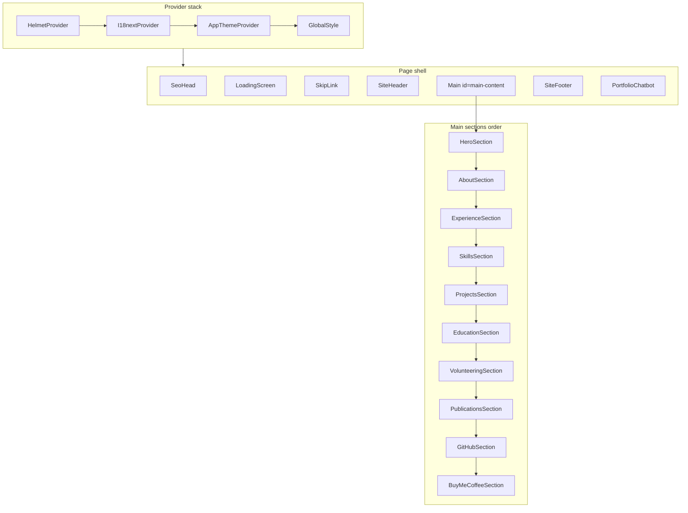
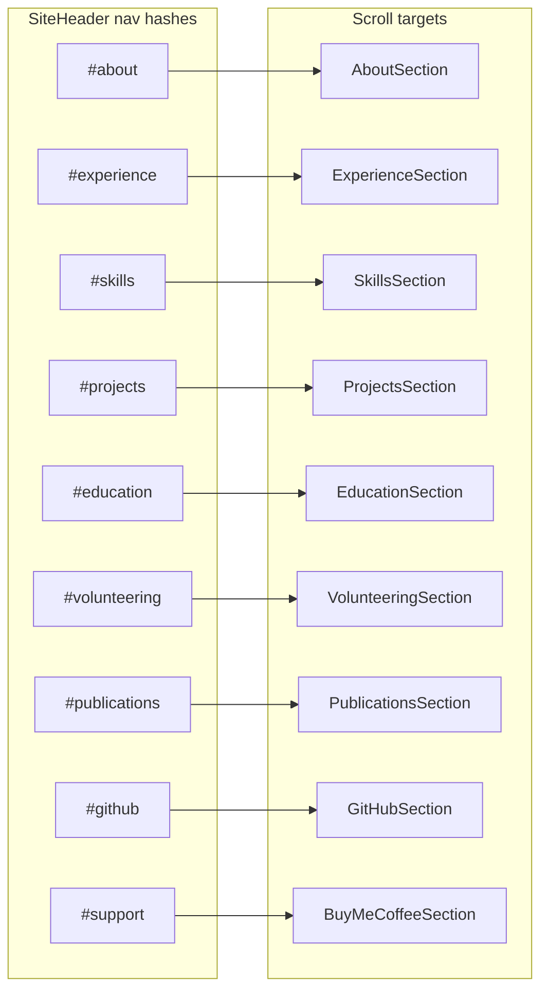
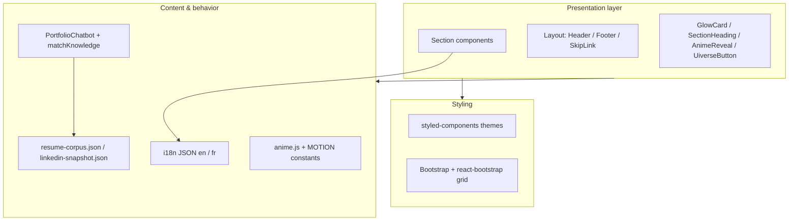

# my-portfolio

Repository for **Kaustubh Dutta**’s portfolio site: projects, experience, publications, résumé links, and bilingual (English / French) content.

<h2 align="center">
  Portfolio Website 
  <a href="https://kaustubhdutta.com/" target="_blank">Kaustubh Dutta</a>
</h2>

  

 

<h3 align="center">
    🔹
    <a href="https://github.com/kdutta25/my-portfolio/issues">Report Bug</a> &nbsp; &nbsp;
    🔹
    <a href="https://github.com/kdutta25/my-portfolio/issues">Request Feature</a>
</h3>

---

## Tech stack

- **Runtime:** React 18, TypeScript, **Vite 5**
- **Styling:** styled-components 6, Bootstrap 5 + react-bootstrap (layout grid / utilities)
- **Motion:** anime.js (entrance animation, micro-interactions)
- **i18n:** i18next + react-i18next (`src/locales/en.json`, `fr.json`)
- **SEO:** react-helmet-async (`SeoHead`)
- **Extras:** react-icons, react-github-calendar, floating **Portfolio** chat panel with lightweight FAQ matching (`src/chat/matchKnowledge.ts` + JSON corpora)

---

## Application views (single-page sections)

The UI is one **long-scroll landing page** (`src/App.tsx`). There is no client-side router; **“views”** are scroll targets (`id` anchors) wired from the sticky header and the chatbot.

| Anchor | Section component | Role |
|--------|-------------------|------|
| `#top` | `HeroSection` | Above-the-fold identity: photo, headline, tagline, primary CTAs (scroll / external links). |
| `#about` | `AboutSection` | Bio / positioning narrative (`aria-labelledby="about-heading"`). |
| `#experience` | `ExperienceSection` | Timeline-style work history (`ExperienceGrouped` + locale-driven copy). |
| `#skills` | `SkillsSection` | **Professional skillset** grid (languages, frameworks, tools including image-based entries). Nested **Models & assistants** region lists AI tooling cards (Composer, GPT Codex, Claude Opus) with artwork under `public/images/ai-models/`. |
| `#projects` | `ProjectsSection` | Featured projects / cards. |
| `#education` | `EducationSection` | Degrees and institutions. |
| `#volunteering` | `VolunteeringSection` | Volunteer roles. |
| `#publications` | `PublicationsSection` | Papers / publications list. |
| `#github` | `GitHubSection` | Contribution calendar (`react-github-calendar`) and GitHub presence. |
| `#support` | `BuyMeCoffeeSection` | Support / “Buy Me a Coffee” call-to-action. |

**Global chrome (not section anchors):**

- **`SiteHeader`** — Sticky nav; hash links above + theme / language toggles; résumé PDF opens externally.
- **`SiteFooter`** — Attribution, copyright, social links, “Built with React, TypeScript and Vite”.
- **`SkipLink`** — Skip to `#main-content`.
- **`LoadingScreen`** — Full-screen loader until ready (skipped in test env via `isTestEnv()`).
- **`PortfolioChatbot`** — Fixed panel: section chips, regex/heuristic replies, optional scroll-to-hash; resume corpus matching for FAQ-style answers.

---

## UI architecture

- **Composition root:** `App` wraps **HelmetProvider** → **I18nextProvider** → **AppThemeProvider** → `GlobalStyle` + page shell.
- **Theme:** `AppThemeProvider` toggles **light/dark** `AppTheme` tokens (`src/theme/theme.ts`) — colors, typography stacks (`Syne` / `DM Sans` / `JetBrains Mono`), radii, shadows — persisted in `localStorage` and synced to `document.documentElement` / Bootstrap `data-bs-theme`.
- **Section pattern:** Most sections use a styled `<section>` with `scroll-margin-top` for sticky header offset, **`SectionHeading`** (eyebrow + title + bar), optional **`GlowCard`** wrapper, **`AnimeReveal`** for staggered entrance, and **react-bootstrap** `Container` / `Row` / `Col` for responsive grids.
- **Content:** Copy lives in JSON locales; structured résumé/chat context in `src/data/*.json`; static assets under `public/` (images, PDF).
- **Accessibility:** Landmark regions, labelled headings, skip link, reduced-motion respected where wired (e.g. hero / nav animations).

---

## Test report

### Vitest (unit / component)

**Command:** `npm test` or `npm run test:run`

**Last structured run:** 20 test files, **22 tests**, all passing (Vitest 2, jsdom, `src/setupTests.ts`).

| Area | File | What it covers |
|------|------|----------------|
| App shell | `App.test.tsx` | Banner, main, contentinfo landmarks |
| Chat matching | `matchKnowledge.test.ts` | Nokia / LinkedIn / education intent snippets from corpus |
| SEO | `SeoHead.test.tsx` | Document title from i18n |
| Layout | `SiteHeader.test.tsx`, `SiteFooter.test.tsx`, `SkipLink.test.tsx` | Nav landmark, footer “built with” line, skip control |
| Theme / i18n | `ThemeToggle.test.tsx`, `LanguageToggle.test.tsx` | Mode toggle, language switch label |
| UI primitives | `GlowCard.test.tsx`, `SectionHeading.test.tsx`, `AnimeReveal.test.tsx`, `UiverseButton.test.tsx` | Render / interaction contracts |
| Sections | `HeroSection`, `AboutSection`, `ExperienceSection`, `SkillsSection`, `ProjectsSection`, `EducationSection`, `VolunteeringSection`, `PublicationsSection` | Key visible copy or regions |

Configuration: `vite.config.ts` → `test` block (`include: src/**/*.test.{ts,tsx}`).

### Cypress

| Suite | Location | Scope |
|-------|----------|--------|
| E2E | `cypress/e2e/portfolio.cy.ts` | Loads home, checks header/main/footer, headings, `#publications`, language toggle → French nav label |
| Component | `cypress/component/all.cy.tsx` | Mounts App and individual sections/components with shared provider helper (`support/mountUi.tsx`) |

**Commands:** `npm run cypress:open`, `npm run cypress:run`, `npm run cypress:component`

---

## Scripts

| Script | Purpose |
|--------|---------|
| `npm start` / `npm run dev` | Vite dev server (**default port `4044`** — see `vite.config.ts`) |
| `npm run build` | Production build to `dist/` |
| `npm run preview` | Preview production build |
| `npm run typecheck` | `tsc --noEmit` |
| `npm test` | Vitest watch |
| `npm run test:run` | Vitest single run (CI-friendly) |
| `npm run knowledge:refresh` | Regenerate resume chat corpus (`scripts/refresh-resume-corpus.py`) |
| `npm run deploy` | `gh-pages` deploy from `dist/` (after `predeploy` build) |

---

## Getting started

1. **Install:** `npm install`
2. **Develop:** `npm start` — open **http://localhost:4044**
3. **Edit content:** Primary copy is under `src/locales/en.json` and `fr.json`; section-specific presentation under `src/components/sections/` and `src/components/projects/` / `experience/`.

### Show your support

Give a ⭐ if you like this website!

